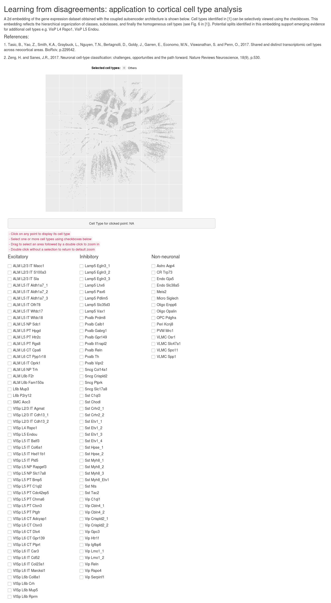

## Scatterplot for 2D Autoencoder embeddings of scRNA seq data

This was a simple visualization tool with `shiny` and `R` I made to inspect an unsupervised 2D representation of scRNA seq data for brain cells published in [Tasic 2018](https://www.nature.com/articles/s41586-018-0654-5). We were writing a paper related to the topic at the time, and I coded up this app as an excuse to learn some rudimentary `R`. 

#### Live app:
The app may be accessed at https://cortical-types.shinyapps.io/nips18/ - depending on the monthly quota restrictions for free hosting from https://www.shinyapps.io/.

#### App description
Each dot on the scatterplot corresponds to one cell in the representation. The colors indicate cell type labels. The key observations were: 

1. Cells with the same type label group together
2. Hierarchical relationships of the cell types are preserved (e.g. neurons appear separate compared to non-neuronal cells, within neurons the inhibitory cells appear searated from excitatory cells etc.)

#### Interactivity:
- Click on any point to display its cell type annotation
- Select one or more cell types using checkboxes below
- Drag to select an area followed by a double click to zoom in
- Double click without a selection to return to default zoom

Here is a screenshot of the live app:

